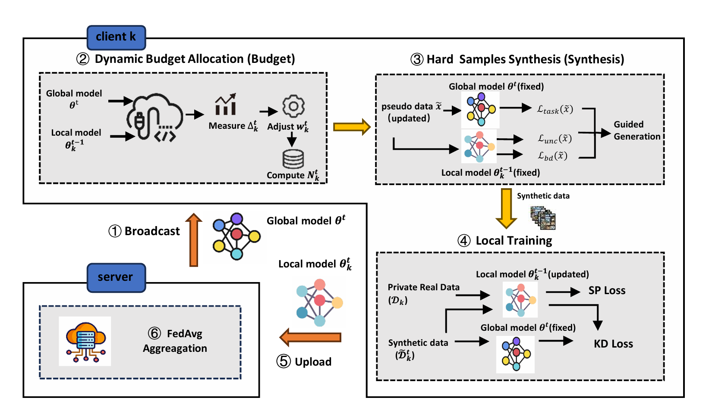

# FedHUA: Federated Heterogeneity and Uncertainty Guided Alignment via Query Generation

This repository accompanies **FedHUA** (**Fed**erated **H**eterogeneity and **U**ncertainty Guided **A**lignment), a data free federated learning method for non IID data. FedHUA preserves the standard federated learning communication boundary: every client retains both real data and generated queries locally, while only model parameters are exchanged.

## Framework overview

The implementation follows the six stage workflow in the manuscript: the server broadcasts the global model; each client measures local global discrepancy and assigns a client specific query budget; the client synthesizes teacher supported uncertainty and boundary guided queries; it performs local supervised learning and knowledge distillation; local models are uploaded; and the server aggregates them with FedAvg.



## Method implemented in this release

FedHUA uses a client side **measure, generate, and align** loop after a FedAvg warm up stage.

1. **Measure correction demand.** Client \(k\) compares its retained previous local model with the current global model and computes normalized drift \(w_k^t\). Its query budget is \(N_k^t=N_0\,\mathrm{clip}(1+\alpha w_k^t,s_{\min},s_{\max})\).
2. **Generate fixed target alignment queries.** The round budget is allocated across classes using scarcity and the previous local model's class wise entropy. Largest remainder rounding produces integer quotas that sum exactly to \(N_k^t\). For each preassigned target, the code directly optimizes a noise input with the global teacher's task loss, minus local entropy, plus the local top 1/top 2 margin. A query is retained only when it satisfies both the target specific teacher confidence threshold \(\tau_g\) and the local boundary margin threshold \(\tau_b\).
3. **Align locally.** The client initializes its student from the current global model and minimizes supervised loss on private data plus the knowledge distillation loss on accepted local queries. The Fashion MNIST coefficient is 0.01; for CIFAR 10 and CIFAR 100, the coefficient follows the client cardinality completion rule in the paper.

The main entry point is `fedhua.py`.

## Setup

Use Python 3.9 or later. Install a PyTorch and torchvision build appropriate for your CUDA or CPU environment, then install the remaining dependencies:

```bash
pip install -r requirements.txt
```

## Reproducing the example configuration

The example below uses Fashion MNIST, ten clients, a 50 round FedAvg warm up, and 20 FedHUA rounds.

```bash
python -u fedhua.py \
  --dataset fashionmnist --gpu 0 --partition noniid --beta 0.1 \
  --model simplecnn-mnist --n_parties 10 --sample_fraction 1.0 \
  --num_local_iterations 100 --warmup_rounds 50 --comm_round 70 \
  --base_budget 256 --generation_steps 500 --lr_g 0.01 \
  --alpha 1.0 --budget_min_scale 0.5 --budget_max_scale 2.0 \
  --lambda_u 0.3 --lambda_b 0.1 \
  --tau_g 0.70 --tau_b 0.30 --max_query_attempts 10 \
  --save_model
```

`run.sh` contains the same command. The retention thresholds are exposed explicitly because they control the acceptance set described in the manuscript; set them to the values used in the intended experiment.

## Key arguments

| Argument | Meaning |
|---|---|
| `--warmup_rounds` | Number of initial FedAvg rounds before query generation. `--start_round` is retained as an alias. |
| `--base_budget` | Base number \(N_0\) of synthetic queries per client and round. `--synthesis_batch_size` is retained as an alias. |
| `--generation_steps` | Number \(G\) of direct input optimization steps. `--g_steps` is retained as an alias. |
| `--alpha`, `--budget_min_scale`, `--budget_max_scale` | Drift to budget scaling and clipping parameters. |
| `--gamma`, `--entropy_batches` | Class allocation parameters for scarcity and class wise uncertainty. |
| `--lambda_u`, `--lambda_b` | Generation weights for local entropy and local boundary margin. |
| `--tau_g`, `--tau_b` | Teacher confidence and local margin acceptance thresholds. |
| `--max_query_attempts` | Maximum number of reinitialization attempts for pending query targets. |
| `--temperature` | Knowledge distillation temperature. |

The theory in the manuscript covers the full participation FedHUA stage. The code permits `--sample_fraction < 1.0`, in which case a selected client uses its most recently retained local model for guidance.

## Baselines

`fedavg.py`, `fedprox.py`, and `moon.py` are retained for comparison experiments. They are not part of the FedHUA method implementation.
